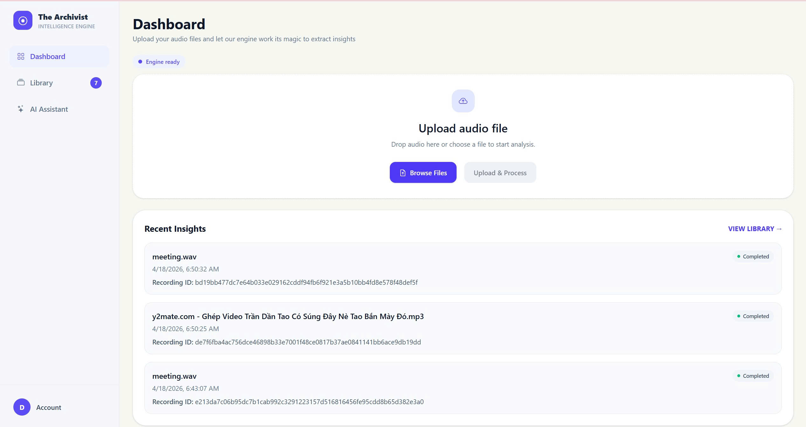
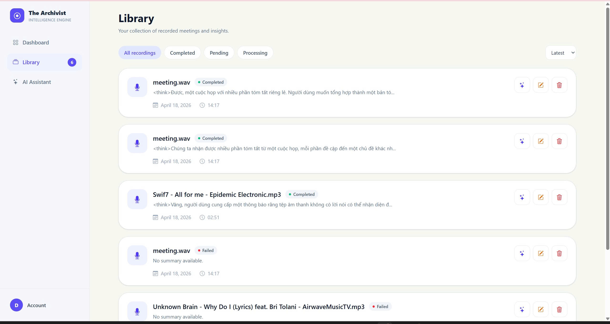
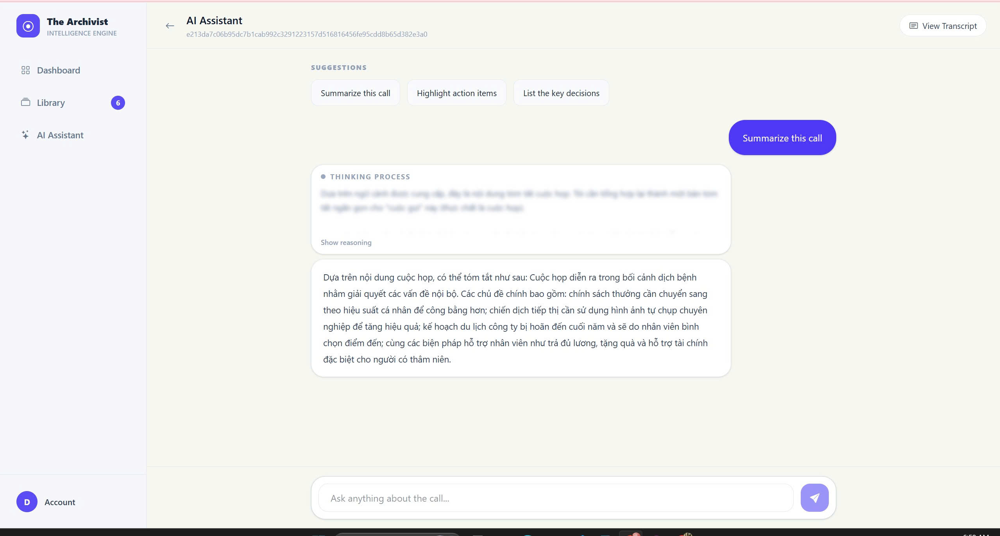

# Voice Summarizer

Voice Summarizer is an audio intelligence web application for uploading recordings, generating transcripts, summarizing conversations, and asking questions about meeting content. The product is presented in the interface as **The Archivist**.

The system uses a React frontend, a FastAPI backend, Celery workers for asynchronous processing, and AWS services for authentication, storage, transcription, and metadata management.

## Preview

### Dashboard



### Library



### AI Assistant



## What It Does

- Upload audio recordings from the browser.
- Store raw audio and generated artifacts in Amazon S3.
- Start speech-to-text transcription with Amazon Transcribe.
- Track recording status and metadata in Amazon DynamoDB.
- Generate summaries, topic segments, and vectorized retrieval data.
- Ask questions about a specific recording through an AI assistant.
- Render assistant responses with Markdown support.
- Manage recordings from a dedicated library view.

## Architecture

```text
Browser
  |
  | React + Vite frontend
  v
FastAPI backend
  |
  | creates presigned URLs, stores metadata, starts background work
  v
Amazon S3  <---->  AWS Lambda  <---->  Amazon Transcribe
  |
  | transcripts, segment summaries, and processing artifacts
  v
Celery worker + Redis
  |
  | chunking, embedding, summaries, retrieval preparation
  v
DynamoDB + S3 Vector storage
```

The frontend uploads audio directly to S3 using presigned URLs from the backend. S3 events trigger Lambda functions that start transcription jobs. Celery workers wait for transcription output, segment the transcript, generate embeddings, write vectors to Amazon S3 Vector, store summary artifacts in S3, and update recording state in DynamoDB. The assistant then retrieves the most relevant transcript context for each question and uses it to answer in context.

## Retrieval Workflow

The assistant follows a retrieval-augmented generation workflow for each recording:

1. A completed transcript is split into topic-aware chunks.
2. Each chunk is embedded with the configured sentence-transformer model.
3. Embeddings are written to the configured S3 Vector bucket and index.
4. Segment summaries and global summaries are stored in S3.
5. When a user asks a question, the backend selects an appropriate retrieval strategy.
6. The assistant queries the vector index for relevant segments, combines that context with recording memory, and sends the prompt to the configured LLM.

This keeps answers grounded in the uploaded recording instead of relying only on the model's general knowledge.

## Tech Stack

| Area | Technology |
| --- | --- |
| Frontend | React, Vite, AWS Amplify, React Router, React Markdown |
| Backend | Python, FastAPI, Uvicorn, Pydantic |
| Worker | Celery, Redis |
| Cloud | Amazon S3, Amazon S3 Vector, DynamoDB, Lambda, Cognito, Transcribe |
| AI | LiteLLM, Sentence Transformers |

## Repository Structure

```text
voice_summarizer/
+-- api/
|   +-- main.py
|   +-- routers/
|   +-- schemas/
|   +-- lambda_function/
|   +-- fe/
|       +-- src/
|           +-- components/
|           +-- pages/
|           +-- services/
|           +-- aws-config.js
|           +-- config.js
+-- core/
|   +-- audio_process/
|   +-- model_controller/
|   +-- retrieval/
+-- infrastructure/
|   +-- setup_aws.py
|   +-- obj_indices/
|   +-- vectors_controller/
+-- worker/
|   +-- celery_app.py
|   +-- tasks.py
+-- images/
+-- .env.example
+-- requirements.txt
+-- README.md
```

## Prerequisites

- Python 3.11+
- Node.js 20+
- Docker, for running Redis locally
- AWS CLI configured with an IAM identity that can manage S3, DynamoDB, Lambda, IAM, Cognito, and Transcribe resources
- An LLM provider API key supported by LiteLLM

## Environment Variables

Create a local `.env` file from `.env.example`:

```bash
cp .env.example .env
```

On Windows PowerShell:

```powershell
Copy-Item .env.example .env
```

Then update the values for your environment.

Important variables:

| Variable | Purpose |
| --- | --- |
| `REGION` | AWS region used by backend and infrastructure scripts |
| `ENV_MODE` | Runtime mode, usually `dev` or `prod` |
| `CORS_ALLOW_ORIGINS` | Comma-separated frontend origins allowed by the API |
| `BUCKET_NAME` | Main S3 bucket for audio and transcript artifacts |
| `RAW_BUCKET_FOLDER` | S3 prefix for uploaded audio |
| `TEXT_BUCKET_FOLDER` | S3 prefix for Amazon Transcribe output |
| `SEGMENTS_PREFIX` | S3 prefix for generated segment summaries |
| `HISTORY_TABLE` | DynamoDB table for recording status |
| `USER_TABLE` | DynamoDB table mapping users to recordings |
| `MEMORY_TABLE` | DynamoDB table for assistant memory |
| `COGNITO_USERS_TABLE` | DynamoDB table populated by Cognito post-confirmation |
| `VECTOR_BUCKET` | S3 Vector bucket name |
| `INDEX_NAME` | Vector index name |
| `MODEL` | LLM model name used by LiteLLM |
| `API_KEY` | LLM provider API key |
| `CELERY_BROKER_URL` | Redis URL used by Celery as broker |
| `CELERY_RESULT_BACKEND` | Redis URL used by Celery as result backend |
| `VITE_API_BASE_URL` | Public API base URL used by the frontend |
| `VITE_COGNITO_USER_POOL_ID` | Cognito User Pool ID |
| `VITE_COGNITO_USER_POOL_CLIENT_ID` | Cognito app client ID |

Do not commit real secrets. Keep production values outside the repository.

## Local Development

### Backend

Create a virtual environment and install dependencies:

```powershell
python -m venv .venv
.\.venv\Scripts\Activate.ps1
python -m pip install --upgrade pip
pip install -r requirements.txt
```

Start Redis:

```powershell
docker run -d --name voice-summarizer-redis -p 127.0.0.1:6379:6379 redis:7
```

Run the API:

```powershell
uvicorn api.main:app --reload --host 127.0.0.1 --port 8000
```

Check the API:

```powershell
curl http://127.0.0.1:8000/health
```

Start the worker:

```powershell
celery -A worker.celery_app.celery_app worker --pool=solo --loglevel=INFO
```

For Linux or EC2 deployments, `prefork` can be used instead:

```bash
celery -A worker.celery_app.celery_app worker --pool=prefork --loglevel=INFO
```

### Frontend

```powershell
cd api/fe
npm install
npm run dev
```

The Vite development server runs at:

```text
http://localhost:5173
```

Make sure this origin is included in `CORS_ALLOW_ORIGINS`.

## AWS Setup

The project includes an infrastructure helper script:

```powershell
python infrastructure/setup_aws.py
```

The script provisions or updates the main cloud resources:

- S3 bucket and required prefixes.
- S3 Vector bucket and index.
- DynamoDB tables.
- Lambda functions for transcription and Cognito user provisioning.
- IAM roles and policies required by the Lambda functions.
- S3 event notification for audio uploads.

After the script completes, open the AWS Cognito Console and attach the `user-creation-db` Lambda to the User Pool **Post confirmation** trigger.

## Production Deployment

A common production setup is:

- Frontend hosted on AWS Amplify or another static hosting platform.
- FastAPI served on EC2 behind Nginx.
- Redis running in Docker or on a managed Redis service.
- Celery running as a systemd service.
- AWS credentials provided through an EC2 IAM role.

Recommended production settings:

- Set `ENV_MODE=prod`.
- Set `VITE_API_BASE_URL` to the public API domain.
- Restrict `CORS_ALLOW_ORIGINS` to trusted frontend domains.
- Store env values in a server-side environment file or secret manager.
- Replace broad IAM permissions with least-privilege policies.
- Enable HTTPS for both frontend and API domains.

## Development Notes

- The frontend reads environment variables from the root `.env` file through Vite.
- Only `VITE_*` variables are exposed to browser code.
- Lambda environment variables are injected by `infrastructure/setup_aws.py`.
- The assistant is scoped per recording, so chat memory and retrieval context are tied to the selected `recordingId`.
- Transcript artifacts and summary JSON files are stored in S3, while vector search data is stored in S3 Vector.
